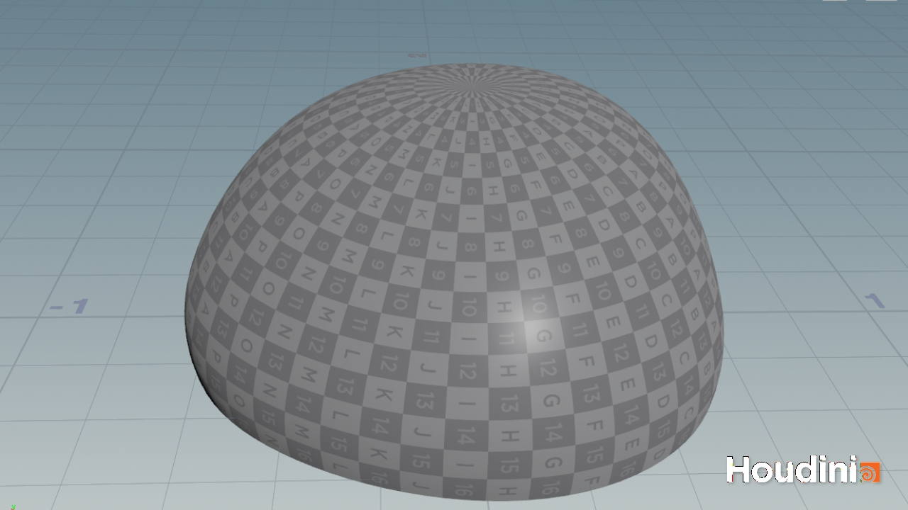
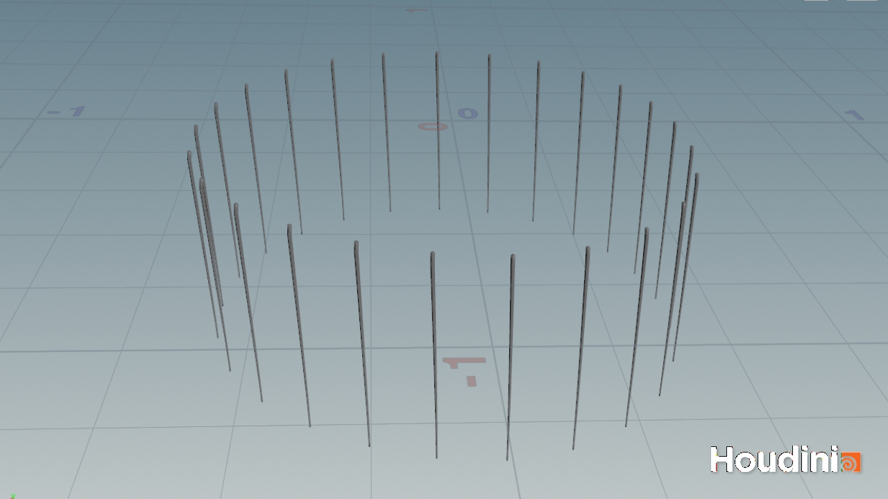
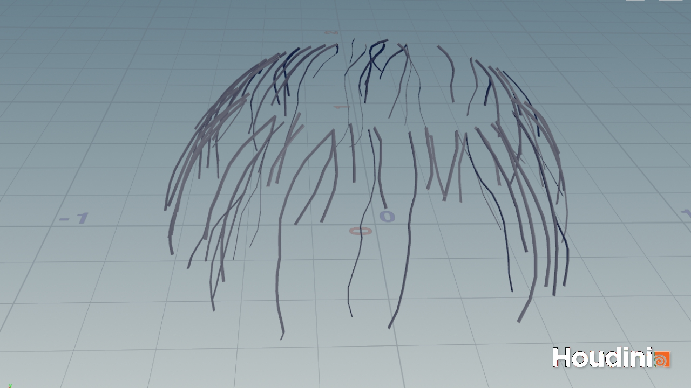
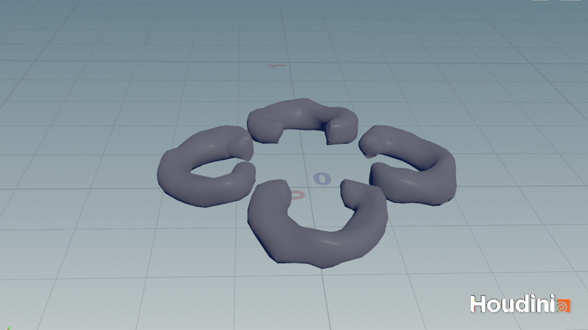
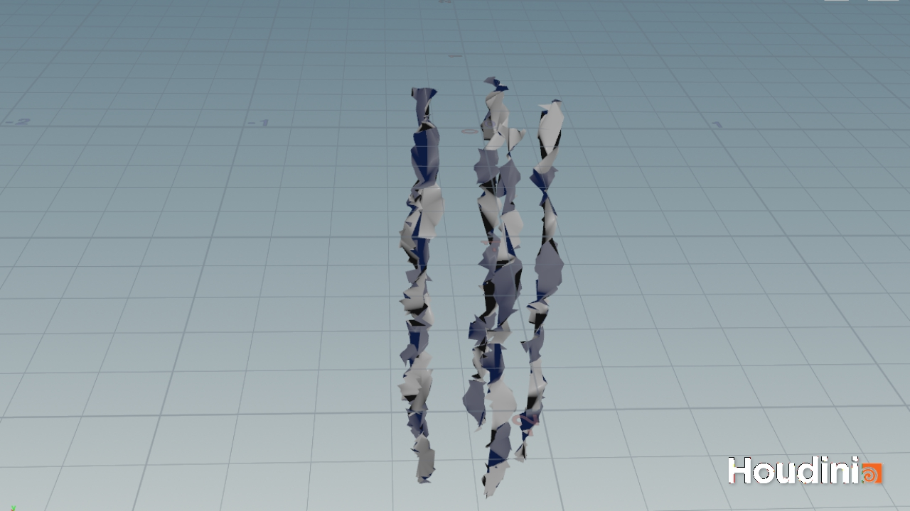

# Procedural Jellyfish
Tongwei Dai (tongweid@seas.upenn.edu)

## Overview
This is a procedural jellyfish created procedurally using Houdini. It consists of 5 parts shown below. Some parts are animated using cloth simulation, while others are animated using keyframes. The jellyfish is then rendered using the Karma renderer.

| Part Name | Output |
|-|-|
| Bell |  |
| Tentacles |  |
| Veins |  |
| Organs |  |
| Arms |  |

## Creating the Jellyfish
In this section I will provide a brief breakdown of how each component was crafted.

### Bell
The bell is the main body of the jellyfish. It is created by revolving a curve around the y-axis. The curve can be controlled using 2 groups of points, one for bending the bottom of the bell, and the other for bending the top of the bell. There is also a transform node that can be used to move the bell up and down along the y-axis.

With this set-up, we can animate the bell by keyframing the groups of points and the transform node.

The bell motion guides the motions of the other components of the jellyfish, even if they are physically based. We have to make sure that everything moves in a way that is consistent with the motion of the bell.

### Tentacles
To create the tentacles around the bell of the jellyfish, we would need a hair-like geometry that wraps around the bell in some interesting way. First, I need a way to get the group of points that the tentacles will be attached to. This is done by extracting the bottom-most points of the bell using a group node, and then using some VEX expressions to skip some points so that the tentacles are not too close to each other.

After I have the group of points to pin the tentacles to, the *copy to points* node can be used to copy the tentacle geometry to the points.

The tantacles are then animated using the Vellum solver with the hair constraint (which handles the pins as well).

### Veins
The veins are created using the *find shortest path* node. The start points are some points near the top of the bell, and the end points are anything below the start points. I first made sure to triangulate the bell geometry so that the generated paths are not too uniform. After we have the path curves, we can sweep a circle along the path to create the veins.

The *point deform* node is used to deform the veins so that they follow the motion of the bell. 

### Organs
The organs are mainly created using the *sweep* node. A Bezier curve defines the "backbone" of the organ, and a circle is swept along the curve to create the organ geometry. To give the organ a more organic look, I used a *mountain* node to add some noise to the curve and smoothed it out a bit with the *smooth* node.

As organs are completely stationary relative to the bell, their motion is simply a change to their transform node.

### Arms
The arms are created by twisting a ruffled surface around the y-axis. Starting with a simple plane, the ruffled surface is created using a combination of *mountain*, *attribute wrangle*, and *smooth* nodes. The *attribute wrangle* node with custom VEX code does the heavy lifting to create the ruffled look; the other nodes are just used to introduce some noise and polish the surface for a more organic look.

The arms are then pinned to the bell's centroid and animated using the Vellum solver with the cloth and pin-to-target constraints.