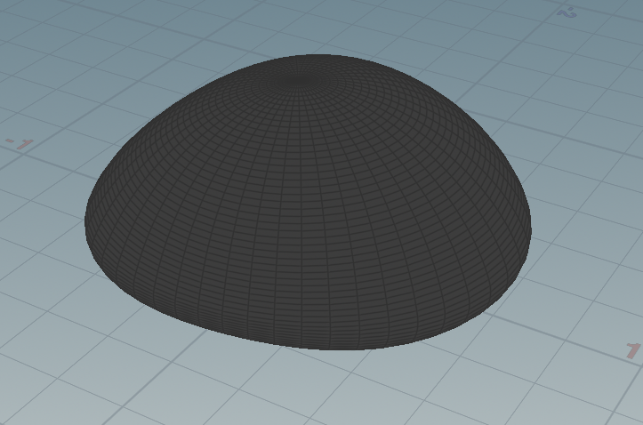
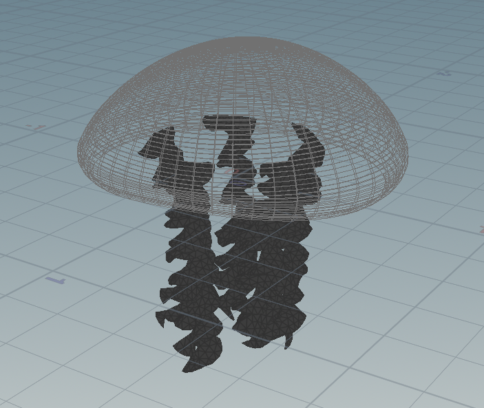
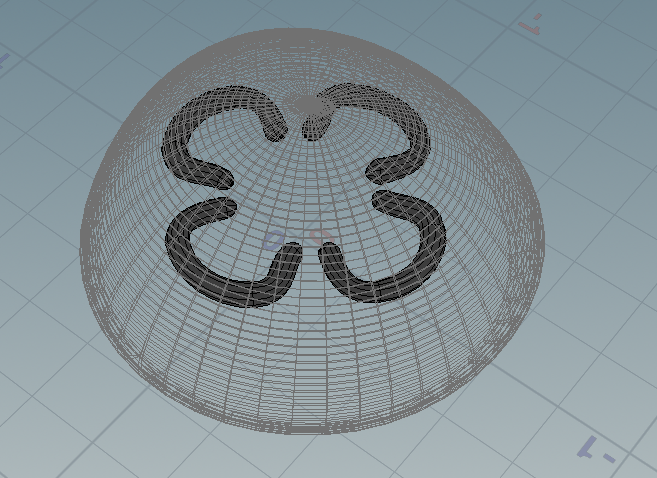
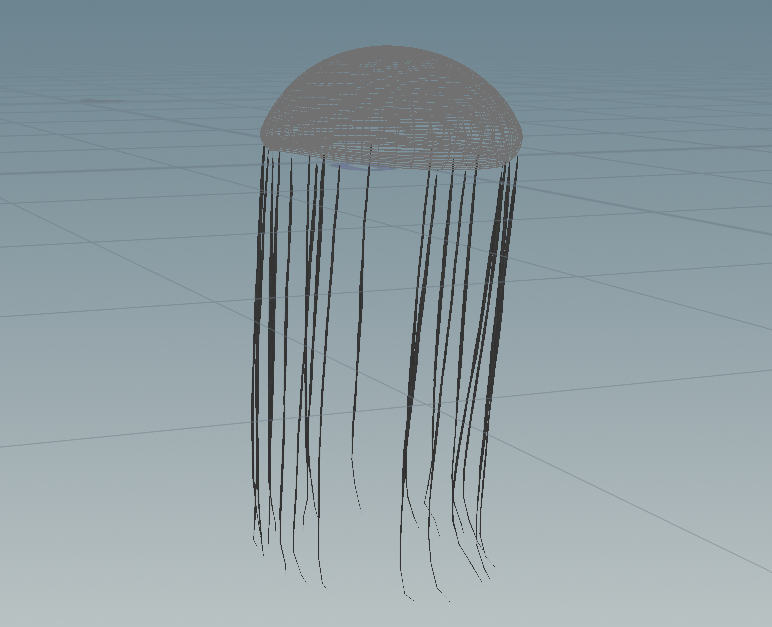
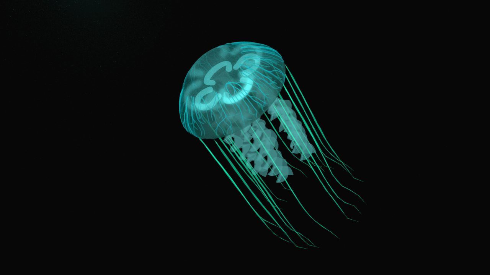

# Procedural Jellyfish

This jellyfish is a project for my Procedural Graphics course at University of Pennsylvania. The jellyfish was procedurally modelled in Houdini and rendered using the Mantra render engine's raytracing mode.

## Process

### 1. Main Body

I created a line, used some bend nodes on it to give it the desired curvature, and finally revolved the line and extruded it to create the base body shape. The body is slightly deformed and animated using the `mountain` noise node.

### 2. Arms

The arms are a grid node that has been twisted with some noise perturbation, and copied a few times around the central axis of the jellyfish. The arms are finally resolved as a cloth inside the Vellum solver, to give them dynamic motion, instead of animating them using keyframes.

### 3. Veins

The veins start from a random sample set of points on the upper section of the base body, then find their shortest path to another random sample set of points on the lower section of the base body.

### 4. Organs

This is a simple curve that is copied around a central axis 4 times and then extruded using the sweep node. A very subtle pulse is added to the geometry using noise nodes.

### 5. Tentacles

Random points are sampled on the bottom faces of the base body, and a line is copied over to all the points. These lines are slightly modified using noise, and then extruded using a sweep node. Finally, the tentacles are pinned to the base shape's deformation, and sent into a Vellum solver node.

### 6. Materials

Everything has a `Principled Shader` applied to it, each slightly varied from the others. All have an albedo somewhere in the blueish-green range, and most have transparency. The organs, veins and tentacles have varying degrees of emission, and the base body has refraction and subsurface scattering turned on.

## Final Result

