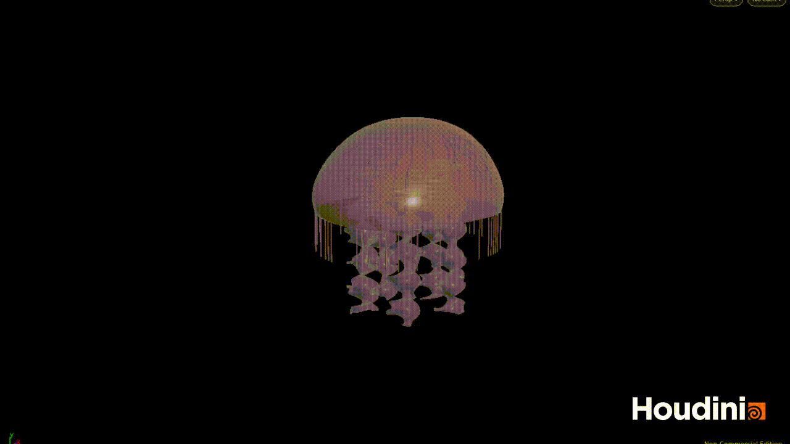

# Procedural Jellyfish

## JELLY | Aboudi Rai

## Bell and Arms
The bell and arms were made by following Elyssa's tutorials, which some slight variation including
color and parameters to the cloth simulation applied to the arms.

## Veins
For the veins, I selected two ranges of points on the bell--one near the northern end and one near
the brim. After defining these two groups of points, I used the Shortest Path node to create lines
between different points from the one group to the other. Finally, I used the Poly Wire node to add
girth, and transformed the veins in accordance with that of the bell.

## Organs
To make the organs, I bent a line along the Y axis until it had the rough shape of the provided
organ. I then appended a Poly Wire node to give the line some girth, and applied a mountain node to
vary the curvature a bit. Finally, I copied this organ four times around the origin, and pinned the
transform to that of the bell.

## Tentacles
The tentacles are made using a Vellum Configure Hair node. A Group Range node is used to select the
bottom ring of vertices at the bottom of the jellyfish's bell, and then randomly select a subset of
them to provide some variance. Lines are applied to each of these selected points, and said lines
then provide the structure for the hair simulation. It was at this point that I added a twirl to the
animation of the bell to show off the properties of the hair-based tentacles.

## Extra
I went ahead and changed the color and opacity of the different parts of the jellyfish to give it a
more realistic feel. The opacity change also allows the visualization of the organs which were
previously hidden.
