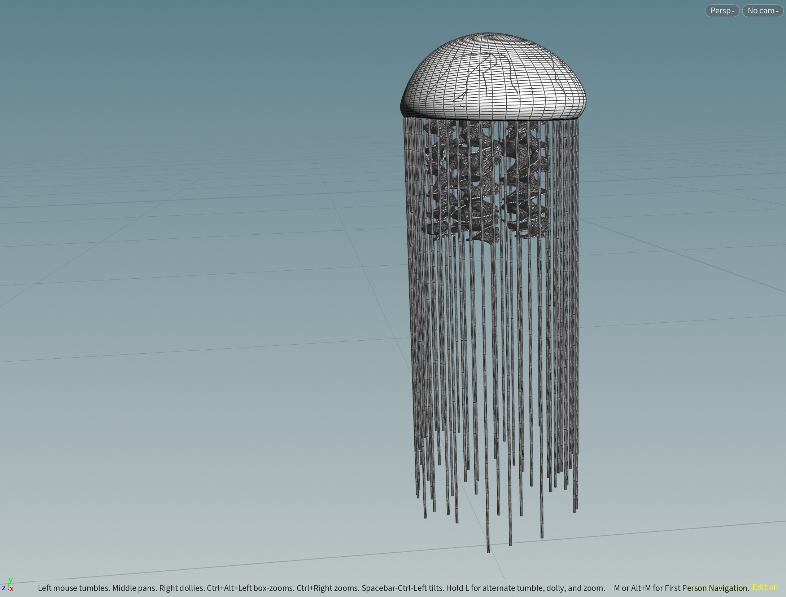
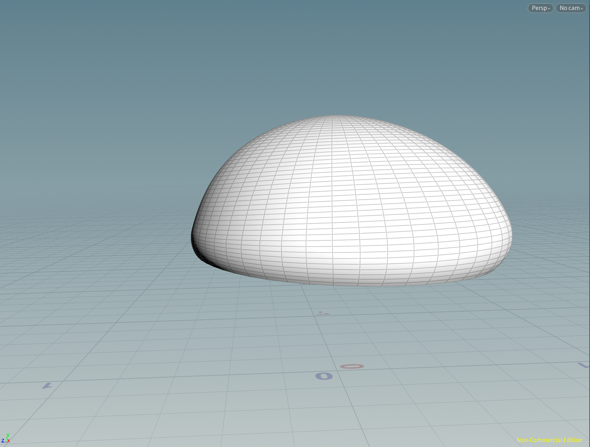
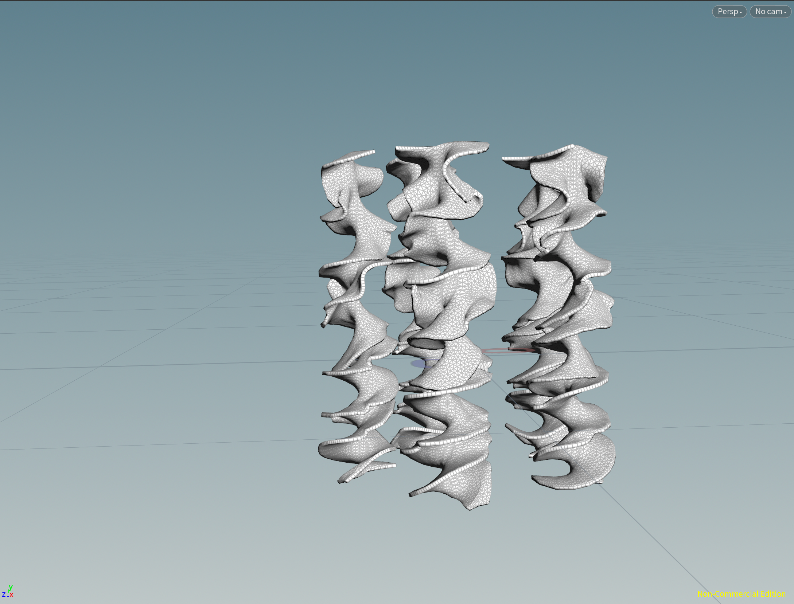
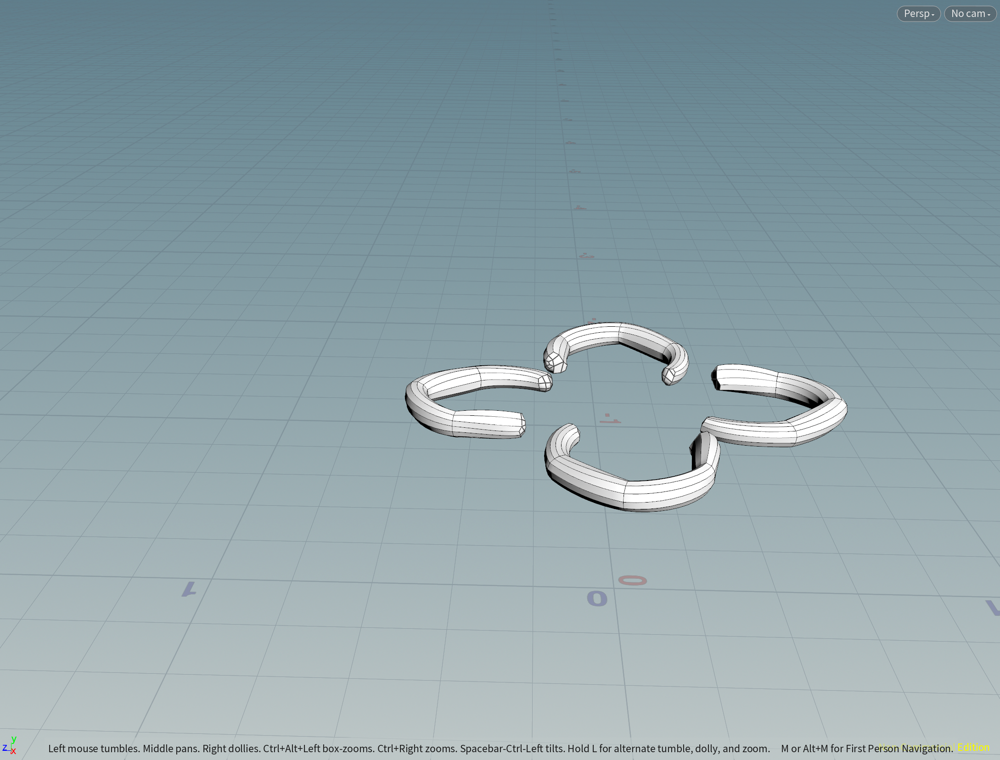
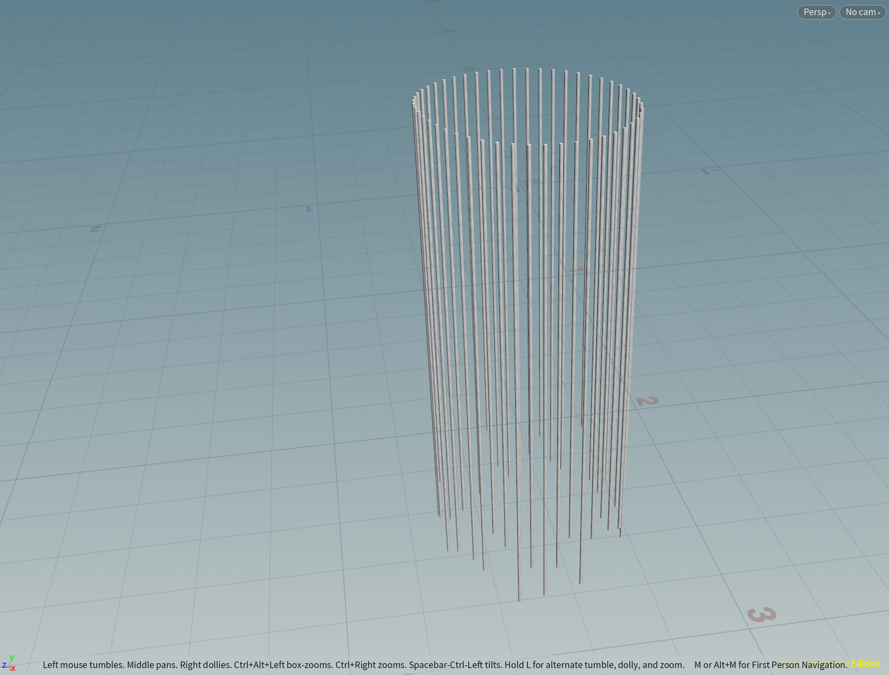

# Procedural Jellyfish

## Project Overview

For this project, I created an animated Jellyfish using Houdini

---

## Details

  

#### Bell

  

Bell is the main part of our Jellyfish. It is created by revolving a line controlled by 2 bends, the upper main part and the lower bell part. However, this will only create a very uniform Bell, so I also add a `mountain` node to introduce some noise into it.

Inorder to animate the Jellyfish, we use a Null node to keep tracing all variables that will change during the animation, like YTransform, and bending angle, etc.. Then I'm able to create the animation you see at the top using keyframes.

#### Arm

  

Arms are created by twisting a grid aligned by XY-Plane. Adding noise using `mountain`, `attribute wrangle`, and `remesh` we can introduce this ruffled surface effect. After copying to 5 copies and then pinning these arms to the top, I use `Vellumsolver` with cloth and pin-to-target `Vellumconstraints` to create this dynamic effect.

#### Organ

  

Organs are created by the `sweep` node. With a self-drawn curve and circle, and of course our favorite mountain, I can sweep out this non-uniform geometry.

#### Vein

  

Veins are somehow the most difficult parts in this project. They are created using thie `find shortest path` node. The start points are some points at the top of the Bell using `Group`, and the end points, similarly, are some points grouped at the bottom. After finding the shortest paths, I use sweep again to create this veins.

#### Tentacles

  

The most important node for creating tentacles is `copytopoints`. I first get the end points of the Bell, which is done by using `group range` and then hardcode the base group to 0-49. Then I copy a line to those points, combining with `attribrandom` to create non-uniform lines, and then creat these tentacles. The tentacles are simulated using `Vellumsolver` again with hair constraints.

