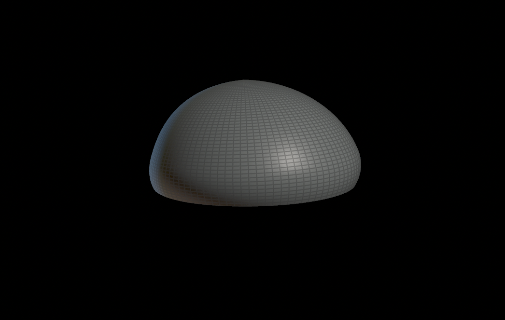
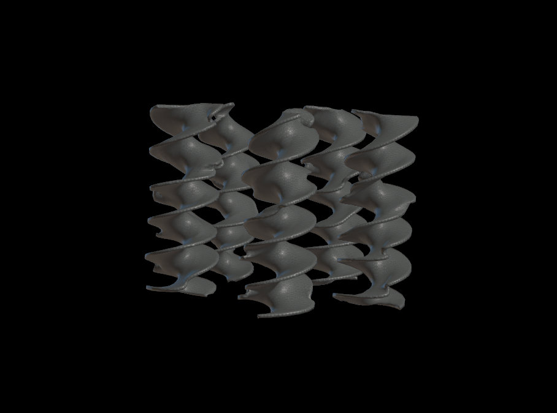
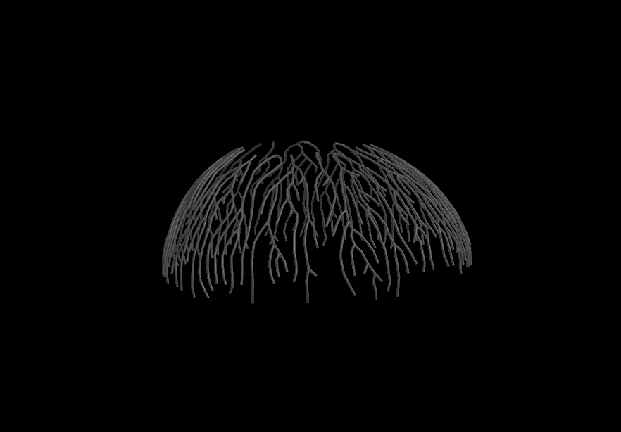
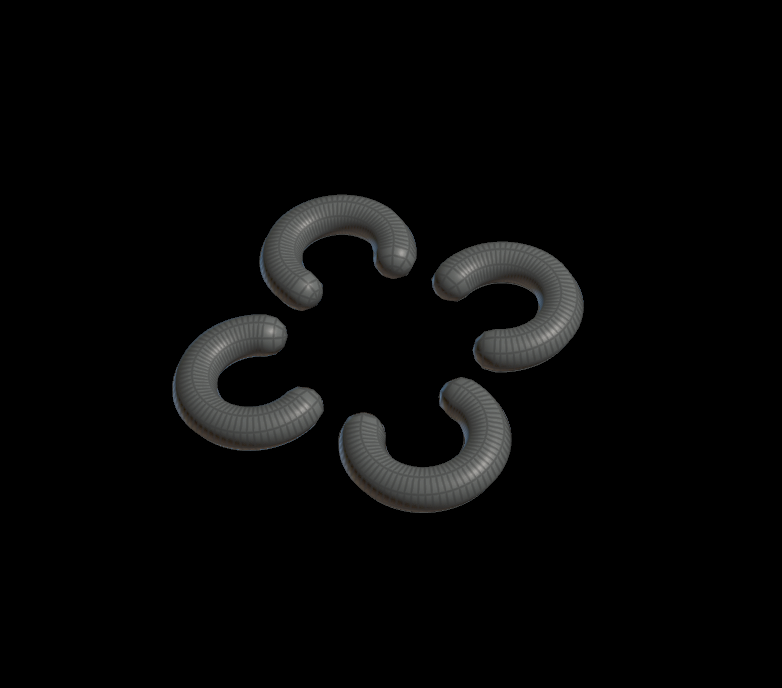
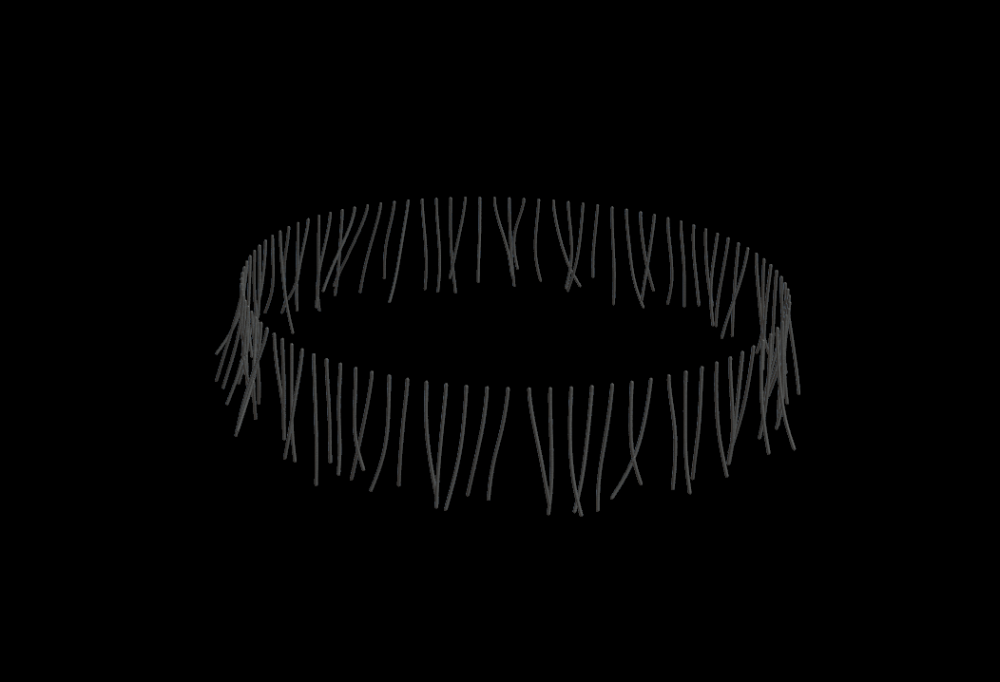

# Procedural Jellyfish

## Animation

|Image| Method|
|:---:|:-----:|
| | I followed the [video](https://www.youtube.com/watch?v=J3X8BB0yNRE) and played around with the animation a bit.|
|| I followed the [video](https://www.youtube.com/watch?v=A_oNXqx8XH4) and changed a few attributes.|
| | I created two point groups on my remeshed bell for start and end points. Then I used the shortest path node and a sweep node for width.|
|   | I curved a line, added width with sweep, and copied it 3 times.|
|  | I followed the given [video](https://www.youtube.com/watch?v=LN4XXaHQkmU) and played around with the pop force to great good motion. I used a sweep node to add width.|

