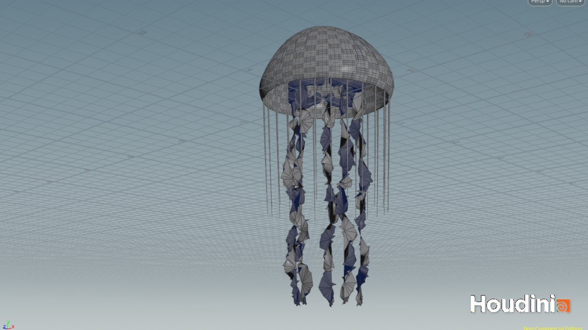

# Procedural Jellyfish
# Jiefu Ling
# Video

| Part Name | Output |
|-|-|
| Bell |  |
| Arms |  |
| Veins |  |
| Organs |  |
| Tentacles |  |
| Jellyfish |  |

# Steps

## Submission
- Fork this repository
- Update your README
    - Please delete the assignment README text
    - A description of your project
    - A video of your animated jellyfish ([video](https://www.youtube.com/watch?v=gXtDd1lPDmc) of how to save a video of your viewport out of Houdini)
- Create a pull request to this repository
- Submit your Houdini file to Canvas along with a link to your pull request
(Don't upload your houdini files to github -- it's a pain to upload big/binary files. Just canvas is fine!)
