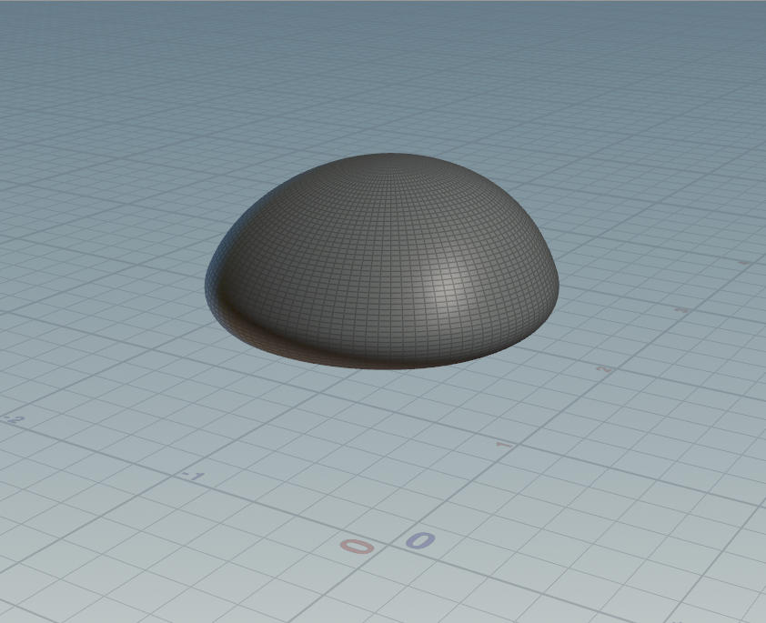
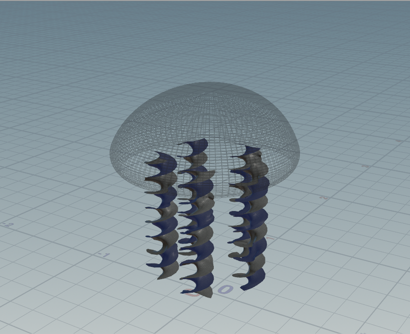
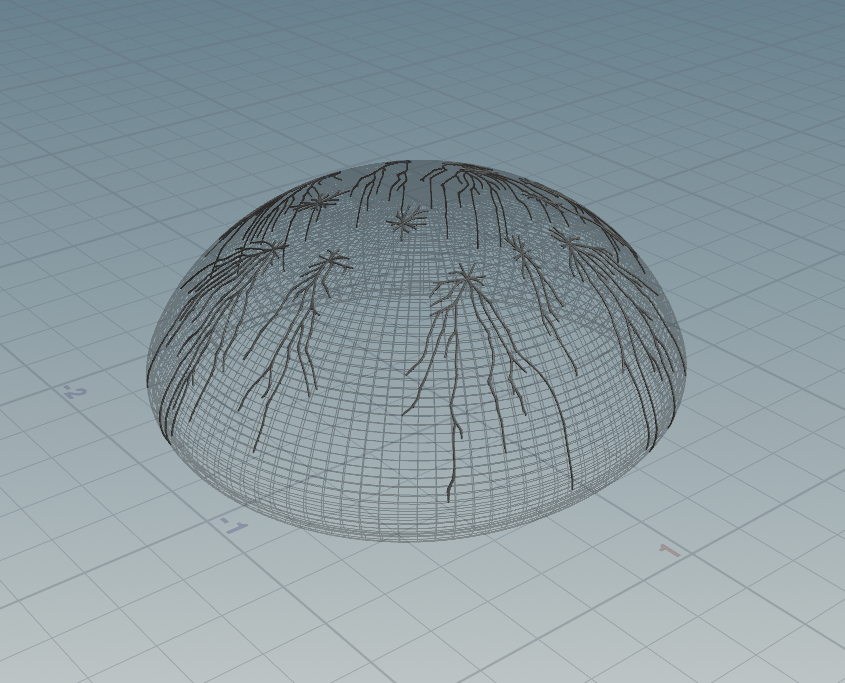
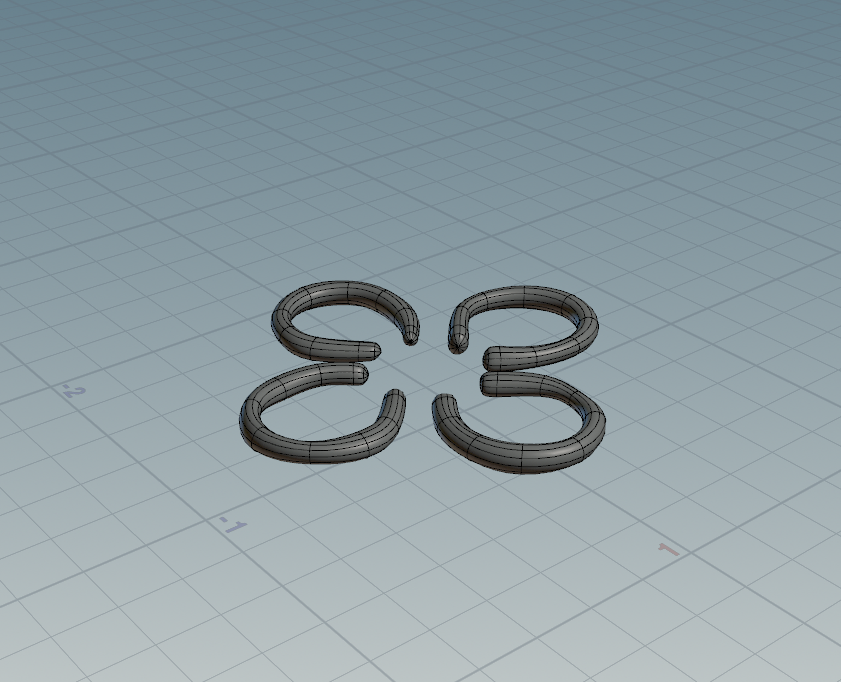
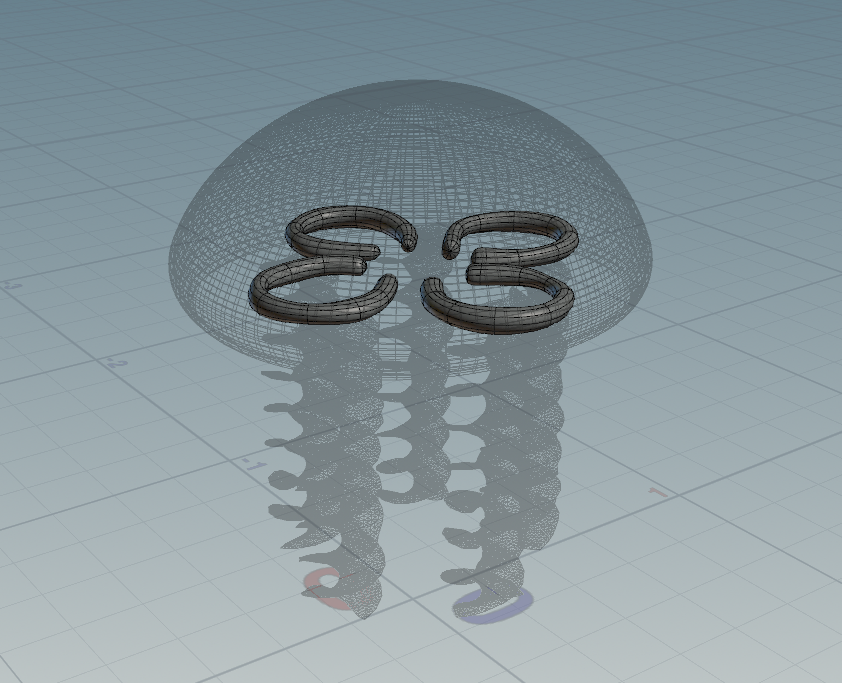
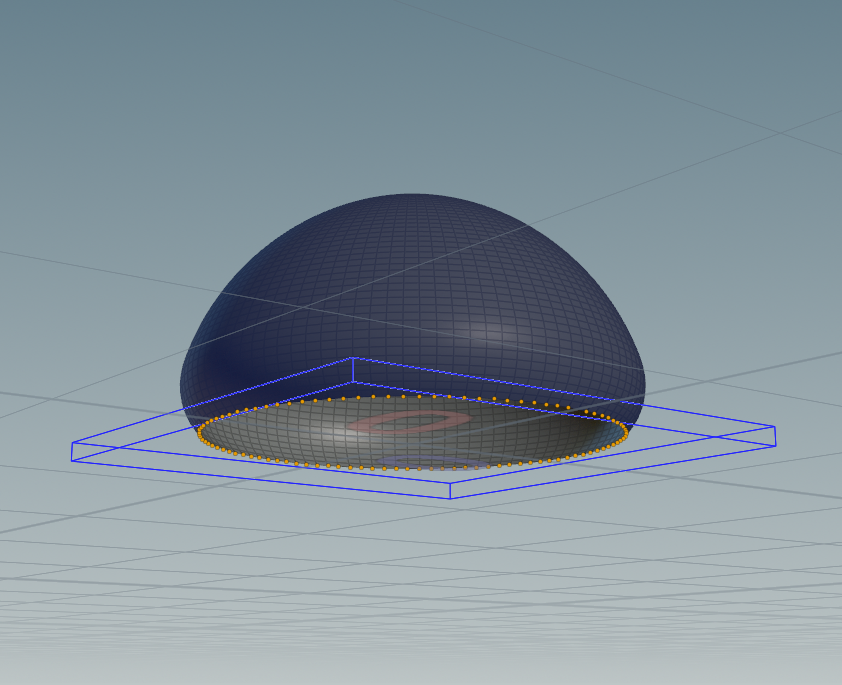
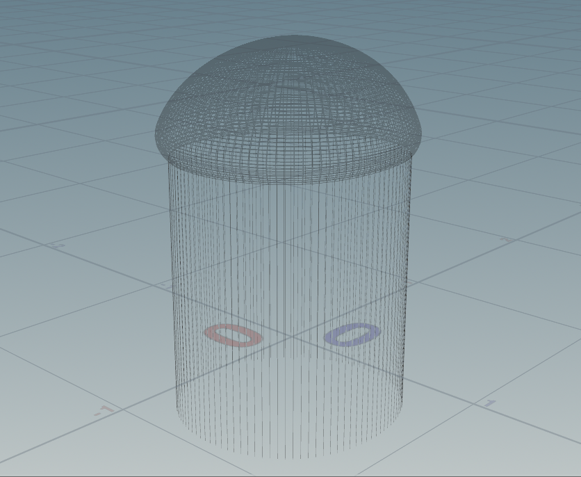

# Procedural Jellyfish in Houdini

This is my first time trying out procedural modelling and animation in Houdini. This fun little project was a good warm-up exercise to get acquainted with the tools and functionalities that Houdini has to offer. My final rudimentary output looks something like this:

I followed the following sequence while modelling the Jellyfish:

## 1. Bell

The first part was the bell of the jellyfish. I created it by:
1. Bending a line twice - inward at the end, and curving the rest of it into a dome-like shape.
2. Revoliving it around the Y axis to get the required shape.
3. Housekeeping like fusing nodes to get rid of redundant points.
I ended up with something that looked like this:

## 2. Arms

Next, I created the Jellyfish's arms. I did this by applying some noise to a grid, and then replicating + rotating them. I had to remesh the arms after twisting the geometry, and then exstruded them a bit to give some thickness. In the end, the arms looked like this:

## 3. Veins

Next were the veins. These were the most fun to model:
1. I randomly selected some points on the surface of the Jellyfish's Bell
2. These points were fed into the Shortest Path Node, which agve me the veiny looking structures
3. I then applied a smooth node to give them a more natural look.
4. A sweep node helped me give them the thickness I wanted.

## 4. Organs

To model the organs, I first created a single organ by making a spline curve and then using a Sweep node to run a cylindrical geometry along the modelled curve. I then replicated and rotated the modelled geometry.

  

## 5. Tentacles

The last bit of the puzzle were the tentacles. For this, I selected the points on the edge of the bell, and then copied a line geometry on all of the selected points.

  

## Animation

1. Vellum Cloth simulation node was used for the Jellyfish's arms.
2. Vellum Hair simulation node was used for the Jellyfish's tentacles.
3. I added POP Force and Attract to the tentacles' solver node to give the hair some variation.
