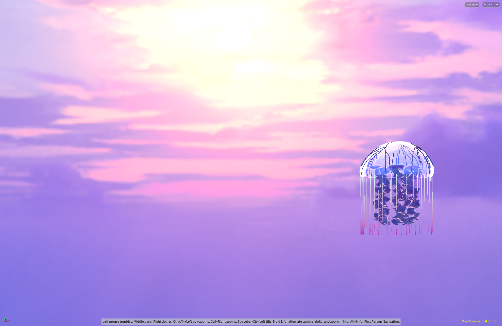
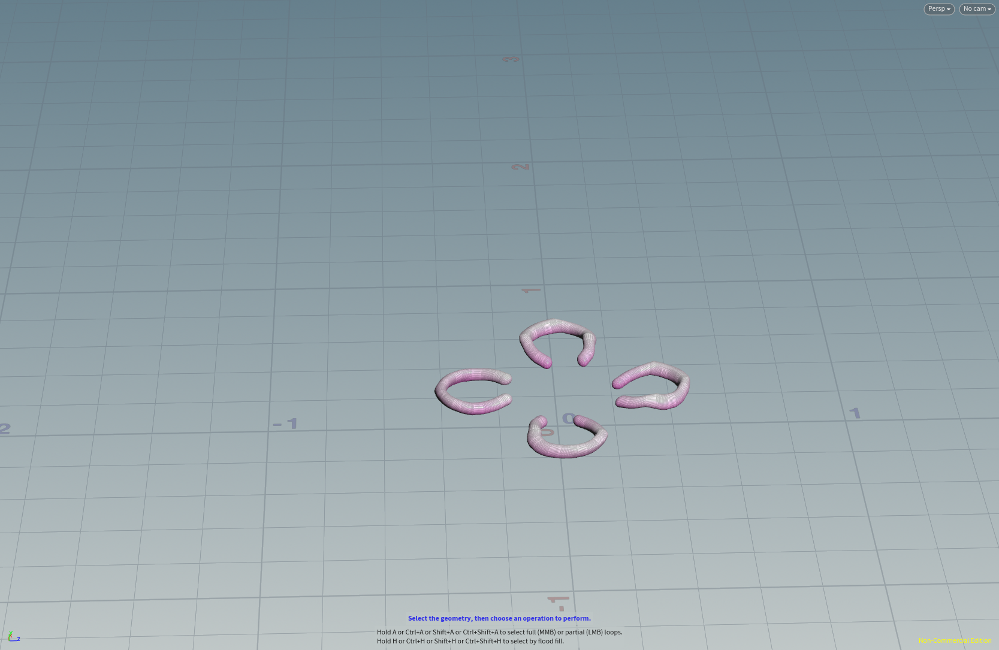

# Procedural Jellyfish
Ruijun(Daniel) Zhong

## Demo
 
 
 

 ### Bell  
 * Initiated with a line node, which was subsequently bent using the bend node.
 * The revolve function was employed to generate the bell shape.
 * To refine and enhance the aesthetics, the fuse, mountain, and polyextrude nodes were applied.
   

 ### Arms  
  * Started with a grid, which underwent a twist transformation.
  * Implemented the vellum constraint with a cloth effect, which was parameterized based on the centroid extracted from the bell structure.
   

 ### Veins  
 * Utilized two groups to categorize the start and endpoint of the remesh derived from the Bell.
 * Employed the find shortest path node to shape the veins.
 * For enhancement, the fuse, smooth, and sweep nodes were applied.
   

 ### Organs  
  * Initiated with a box node.
  * Parameters were adjusted to give it a banana-like shape which was then bent to achieve a U-shape.
  * Utilized the copytopoints node to replicate this shape, placing multiple instances around a central axis.
   

 ### Tentacles
 * Implemented the copytopoints node to produce multiple lines based on the lower edge of the bell structure.
 * Applied the vellum hair node to pin these lines, resulting in motion that emulates the graceful movement of hair or tendrils.
 

 ### Rendering and Animation
 Rendering:
 * Color and transparency adjustments were made using the attribwrangle and attribadjustcolor nodes.
 * A specialized material, camera, and mantra node were configured for rendering in PBR mode.

 Animation:
 * The jellyfish model exhibits a dynamic movement pattern consisting of rotations, bouncing, and scaling-up transformations.
