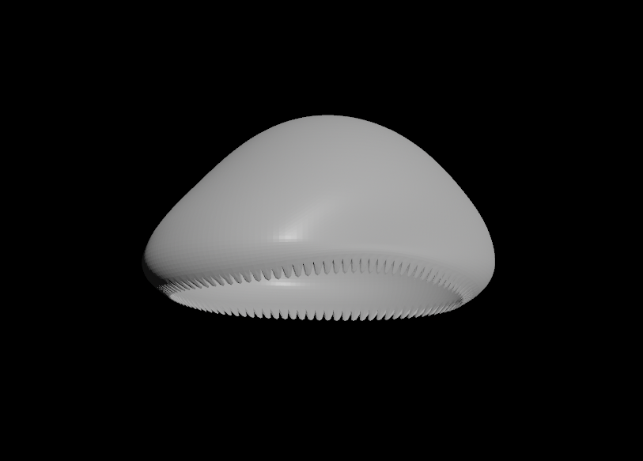
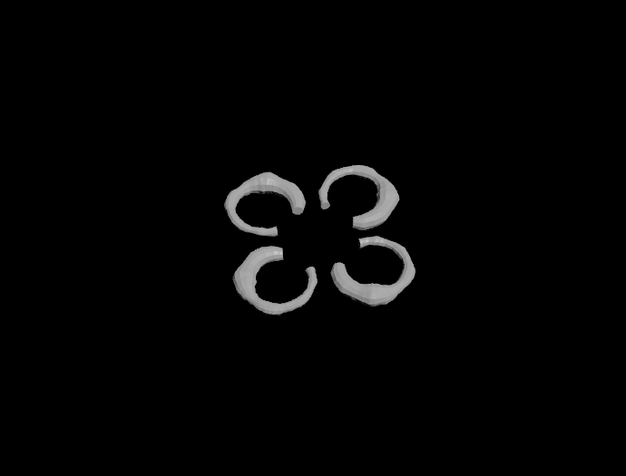
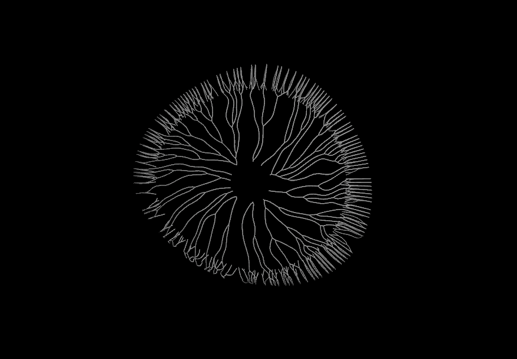

# Procedural Jellyfish

The goal of the project was to create an animated jellyfish using procedural modeling and simulation in Houdini. This was a great first introduction to Houdini and I enjoyed taking the time to discover new nodes and get used to the Houdini workflow.
 

 
The jellyfish contains 5 main parts: the bell, the arms, inner organs, veins, and tentacles.
 
 

 

## Bell
To create the bell, I first used a _line node_ and _3 bend nodes_ to get the desired shape and controls for animating later on. After revolving the line around the Y-axis, I added noise using a _mountain node_ to create a more organic shape. Finally, I used 2 _polyextrude nodes_ and a _subdivide node_ to create a scalloped/ridged edge on the bottom of the bell.
 
 

  
## Arms
For the arms, I closely followed Elyssa Chou's tutorial [at this link](https://www.youtube.com/watch?v=A_oNXqx8XH4). I used VEX to apply a ruffled effect to the arms, twisted the arms about the Y-axis, pinned the top points of the arms to the centroid of the bell, and finally used Vellum Cloth simulation to create an effect of the arms drifting through water.
 
 

  
## Organs
To create the inner organs, I first modified a _line_ using the _bend node_ to get the desired shape. I then used a _polywire node_ to create thickness and experimented with noise values/patterns in the _mountain node_ to create an organic shape. After creating four organs, they were pinned to a fixed location within the bell for animating.
 
 

  
## Veins
To create the veins, I took inspiration from [this handy dandy tutorial](https://www.youtube.com/watch?v=3zL2oqZa-Oc) I found online! After remeshing the bell to triangulate the geometry, I created _2 group nodes_ to represent the start and end of the _shortestpath node_ and used a _carve node_ and _polyextrude node_ to get the desired look.
 
 
 
  
## Tentacles
For the tentacles, I made _group node_ of the bottommost points on the bell and dropped down _line nodes_ that were modified with a _mountain node_ to create a tapered end of the tentacle. Similarly to the arms, I pinned them to the bell and simulated using Vellum Cloth.
 
 

  
## Extra Credit
- added scalloped edges to the bell
- WIP (maybe I'll get it done by the deadline maybe I won't!): create a background with procedurally generated seaweed and coral
- WIP: create a render of the jellyfish
