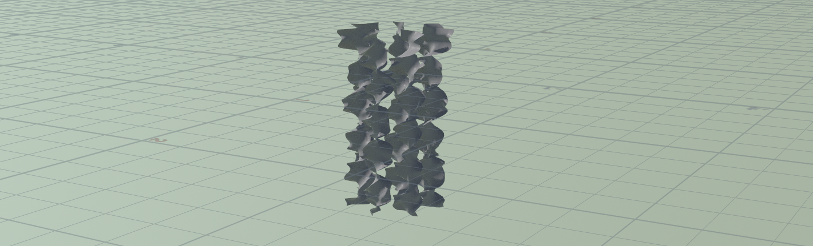

# Procedural Jellyfish

- Chang Liu

- This is an animated jellyfish created using Houdini nodes.

https://github.com/HummaWhite/CIS566-hw02-jellyfish/assets/48054481/357cb307-c17c-466d-851b-913871934c2d

## Bell and Arms

The bell is created by revolving bent lines around one axis.

The arms are created by instancing an arm with rotation offset created from a plane, where noise function is used to add irregularity to the shape.

## Veins

For veins, the approach I used was a little different from the tutorial, although it was still generated by findShortestPath node. The difference was I used another mode that connected all start and end points with almost one path. I used two group nodes to select start points and end points.

## Organs

The organ is created using five curved cylinders. It animates with the bell.

## Tentacles

First, I selected the points at the bottom of the bell, then use copyToPoint to instantiate lines. The lines are attached to a hair solver.
