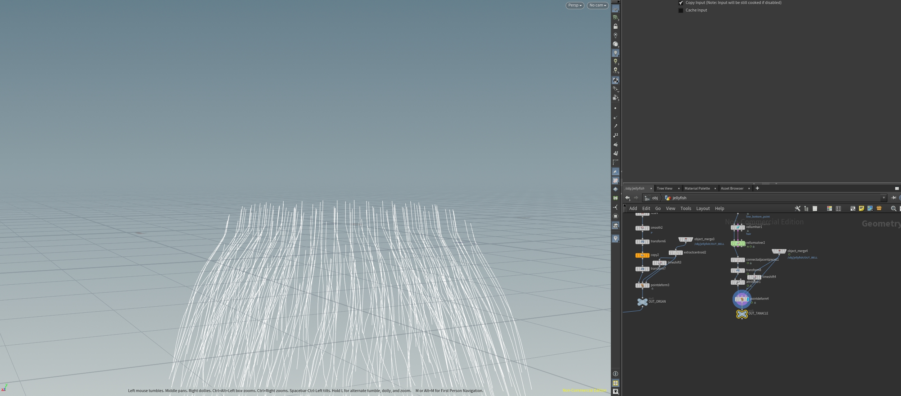

# Procedural Jellyfish

## Final Result

## Process
### Bell 

I followed the tutorial to create a bell shape from curve, noise and extrude node. It creates a outlook like half an egg as the shell of the jellyfish.

### Arms

I followed the tutorial to create the jellyfish's arm. I created a grid, twist and remesh it to a twisted shape. I grouped five identical arms together and use a vellum constraint of cloth to simulate it procedurally.

### Veins

I copyed the nodes without animated paramter of shell creation as the startpoint for veins. I created a start point group and end poing group to clean up all the points in connection. I choose "each start point to all end point" selection in FindShortestPath Node to create the basic shape of veins, and use fuse and smooth node to smooth it. I attached it onto the shell by pointDeform.

### Organs

I use bezier curves as a startpoint to create basic bone for extruding. I use poly wire to extrude the base shape from curve. Afterwards, I use remesh, fuse and smooth node to create a shape more than just a tube. After copying four identical organs, I attached it onto the shell by pointDeform.

### Tentacles

I followed the hair tutorial to initialize the vellum setup for hair material. I add up a little gravity and reverse the direction of tentacles to provide a swinging-like outlook for these tentacles. I attached it onto the shell by pointDeform.

### Full jellyfish

I use a merge node to group everything together. After finishing the geometry, I created a LOP network to setup the lighting and material of the jellyfish following this [tutorial](https://www.sidefx.com/tutorials/jellyfish-project/). This creates a transparent blue outlook under deap sea environmental light.