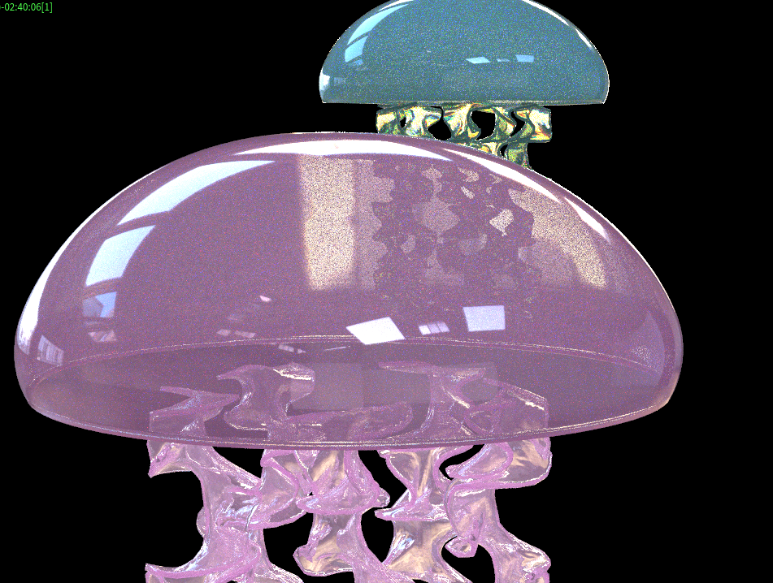

# Procedural Jellyfish

__Important note: I will be updating this README.md with more in depth analysis upon the morrow.__

## Project Overview
This jellyfish project was created for my Procedural Graphics Course. As I still plan to update this README.md and to a further extent my project, I will simply leave the README.md with the screenshots and descriptions, and have the video be up for views in the project folder itself. 

Just in case the video does not show up, I have a series of screenshots that I took for some in progress shots of my work.

## Initial stages, Bell and Arms/Tentacles
For this stage, I simply followed the lovely tutorials provided by the one and only Houdini magician herself, Elyssa Chou. Here is the result texturing and environment mapping that product:

### Initial renders

For this portion of the assignment, I was more struggling with portraying the unique textures of a jellyfish, as the regular PBR shaders on Houdini have not satisfied me enough. I have come to the conclusion that the only way to create a compelling scene is to add more things in the scene for the jellyfish to reflect and show off, which makes the textures more interesting to observe. And perhaps, not to make everything too glowy.

### In progress renders 1

For this in progress checkpoint, I had focused on creating the shortest path nodes and the organs. I had some trouble figuring out the time shifts for the shortest path, but with some pointers from a friend, I managed to map them to the bell.

### In progress renders 2

Finally the jellyfish is beginning to look complete! Upon implementing the hairs/tentacles, I eagerly attached them to the main body of the jellyfish via a merge node, but I soon realised an issue; the hairs were not moving alongside the rest of the jellyfish, meaning that they were not attached properly to the geometry within the logic of the node tree. No matter how beautiful my carefully tweaked values looked, I had no choice but to reimplement the tree, following the advice of Elyssa during OH. Ah, I also experimented the looks and the materials with several different environment maps, including an underwater .png map that I offloaded from the interwebs. 

### Final shots for the time being

And here I present the final product for the time being! I thought that my singular pink jellyfish would be lonely blobbing up and down in a cold, dark endless virtual void, so I took it upon myself to give him a friend. As you can observe, I have fixed the hairs such that instead of growing out of an arbitrary shape, they now grow directly out of a group of nodes encapsulating the bottom vertices of the bell, and hence these points now oscillate with the original jellyfish. The fourth image is also a rendered image using Mantra, but with no environment map and just a handful of area and ambient lights. 

## Updates
I will be updating this page, so please stay tuned for more photos and updates!