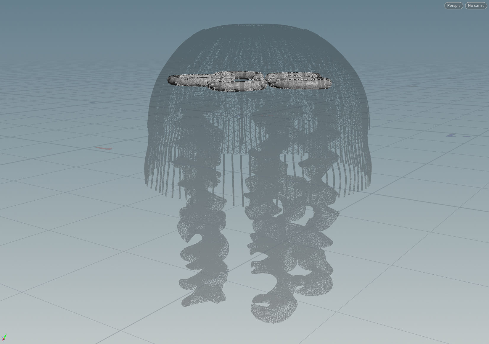

# Procedural Jellyfish

## Demo

https://github.com/GrahamZen/hw02-jellyfish/assets/31180310/dea65d2f-9f34-44e9-b168-fe977fab0a03

## Description

This project is a animated jellyfish, which has five major parts: Bell, Tentacles, Veins, Organs, Arms.

|Part| Image|
|----|------|
|Bell|          |
|Tentacles|             |
|Veins|             |
|Organs|            |
|Arms|          |

# Extra Credit

I added a pink specular material with little transparency to the jellyfish, and rendered it using mantra.
