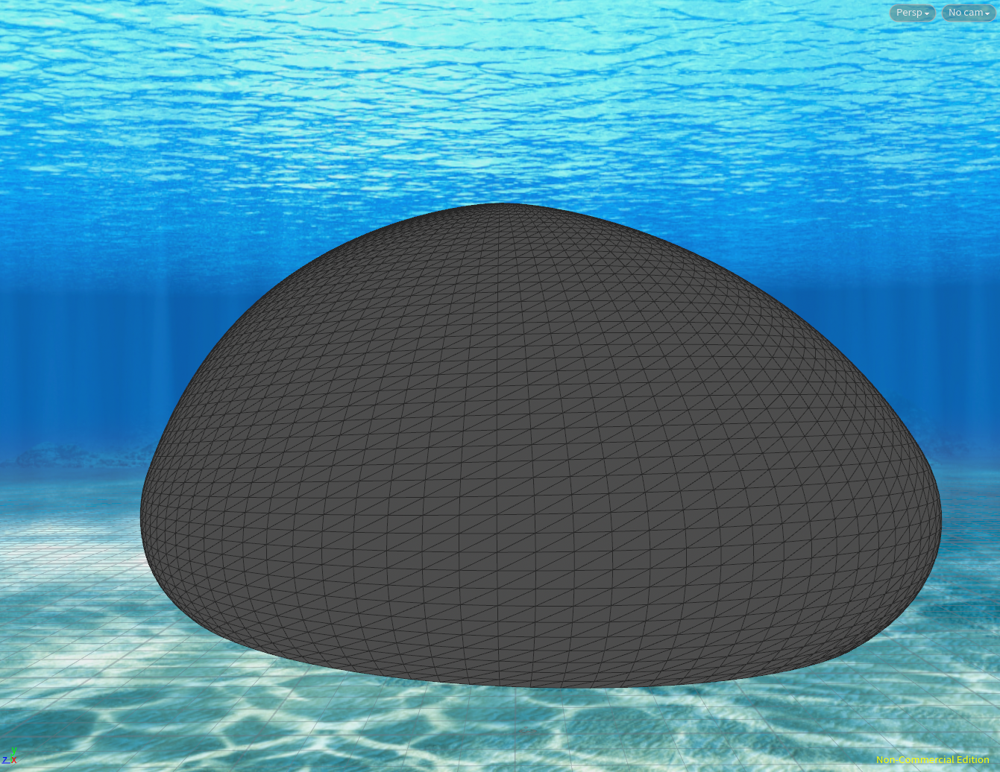
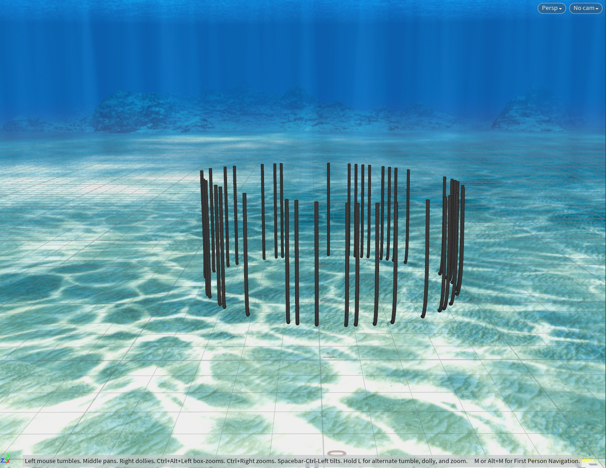

# Procedural Jellyfish
# Jiefu Ling
# Video

| Part Name | Output |
|-|-|
| Bell |  |
| Arms |  |
| Veins |  |
| Organs |  |
| Tentacles |  |
| Jellyfish |  |

# Steps
## Bell
The bell is created from a line. Then I bend it to a curve and revolve it into a bell. Last, I added a mountain node to give it a little bit of variation. 

## Arms
The arms were created by twisting a ruffled surface around the y-axis. Then I use the vellumconstraints to pin the arms to the centroid of the bells and give it a cloth simulation. 

## Veins
First, I used two groups to define the start points and end points of the findshortestpath node by using bounding boxes to select the point on the bell. Then I used the findshortestpath node to create a path for any start point to each end point. Lastly, sweep the paths and pin them to the bells.

## Organs
The organs were generated by sweeping a hand draw bezier curve. Then, pin them to the bell.

## Tentacles
The tentacles were created by attaching a line for each point on the bottom of the bell. Then, add a hair simulation for the lines. 

## Submission
- Fork this repository
- Update your README
    - Please delete the assignment README text
    - A description of your project
    - A video of your animated jellyfish ([video](https://www.youtube.com/watch?v=gXtDd1lPDmc) of how to save a video of your viewport out of Houdini)
- Create a pull request to this repository
- Submit your Houdini file to Canvas along with a link to your pull request
(Don't upload your houdini files to github -- it's a pain to upload big/binary files. Just canvas is fine!)
