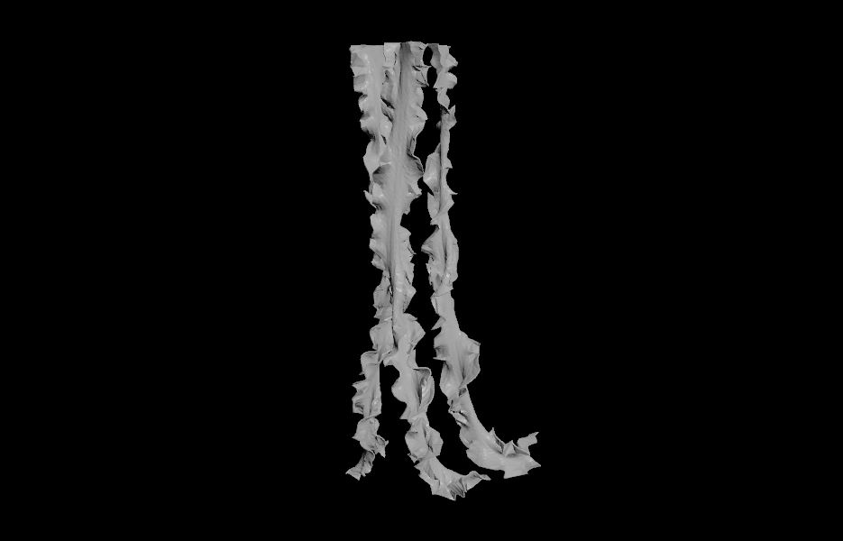

# Procedural Jellyfish

https://github.com/sherryli02/hw02-jellyfish/assets/97941858/13abc34a-2956-4f7d-ae6a-cd454ae55389

Something I particularly wanted to achieve with my jellyfish was not only have many detailed parameters for an artist to be able to fine-tune, but also the ability to quickly generate endless random jellyfish variations. I achieved this by adding a “Randomize” toggle to my controller — if the user checks it, they can scrub through a seed that randomizes dozens of parameters independently!

https://github.com/sherryli02/hw02-jellyfish/assets/97941858/b4e9bafa-61ce-494b-ad20-c303e8e33855

I really enjoyed this project. During my internship last summer, I used Houdini for the first time, which had been exciting but also overwhelming — I’d never worked with a node-based program before, and there was a lot to wrap my head around. This project gave me some more time to flesh out that knowledge, and I really appreciated the opportunity to learn without feeling entirely lost.

## Reference

Looking at reference helped me get a feel for what to prioritize. I noticed that there was quite a bit of variety across jellyfish species, so I looked for elements whose variation was within a sizeable enough scope to procedurally reproduce. I also looked at jellyfish swimming videos to guide my final animation.

## Bell

The main shape of the bell was created by revolving a curve around the y-axis. The user can transform the shape of the bell by controlling the bends of the original curve or by using a taper/squish node, and can also control its overall orientation. 

By copying the original curve and using a distancefrom node with some Vex to displace points in the x and z directions, I added puckered scalloped edges to the bell of the jellyfish. 

From reference, I observed that jellyfish bells seemed to have both an outer transulcent hood and a more opaque interior wall. Thus, I duplicated and transformed the bell with Vex to get a non-extruded and shorter version of the bell. This helped create a more realistic appearance in the render.

## Bell Stripes

My initial approach was to procedurally generate a map that I could pass into the material shader for the bell using the Cd attribute. After some time I pivoted to modelling the stripes instead, an easier approach.

From observing references, I observed that there was a lot of variation in the stripes on different jellyfish: some widened in the middle, and others tapered off at the end. Thus, I used a sweep node to create the base shape to allow the shapes of the stripes to be totally controllable. To have the stripes perfectly emulate the shape of the bell, I extruded them outwards and used a boolean intersect. I also added some noise to their positions and displaced them such that the stripes would be placed right beneath the skin of the bell.

## Bell Spots

I generated spots by scattering points across the bell of the jellyfish, using Vex to randomly vary their sizes and add noise to their positions, using more Vex to ensure less spots are generated near the bottom of the bell, and copying a round sphereish shape to the points.

## Veins

Using Vex, I isolated points near the top of the bell and points near the bottom of the bell, and created lines between them using cost and findshortestpath nodes. I also wrote more Vex to have the tops and bottoms of the veins be displaced towards the center of the bell so that we’d get a fading effect in the render instead of having the veins cut off abruptly.

## Organs

I used a torus, box, and and boolean subtract node to get the main U-shape. I then transformed it, copied it 3 times, and applied noise.

## Arms

Using line, bend, and merge nodes, I create a sort of rounded plane to emulate the shape of an arm. I bent and mirrored the plane to get an indented V-shape. Using sin functions in Vex, I displaced the positions of edges of the arm in a ruffle-like manner. I then copied them, added noise, and put them through a cloth vellum simulation. 

## Tentacles

By using a group node, I isolated the edges at the bottom of the bell, and then used a grouppromote to convert the edges to points. I then used a pointgenerate node to control the number of points. Then I copied a line to each point, added noise through Vex, and ran them through a hair vellum simulation. 

## Controller

See the second video! I connected relative references across over 20 parameters to give the user an intuitive customization interface, and defined value ranges for each parameter so that the user can get a nice-looking jellyfish no matter what.

The user can toggle Randomize to have their custom parameters be overwritten by pseudo-random values based on the seed. Infinite random jellyfish can be generated, and each of them are unique. In order to have the seed independently randomize each parameter within my desired ranges, for each parameter I multiplied rand(seed) by a unique decimal and used the fit function. 

Spots, stripes, and veins are generated with a 30% chance each, and never together; from reference images, it seemed that most jellyfish tended to visibly have only one of them at a time. 

## Shading

I spent a lot of time adjusting the shaders to get the look I wanted; each part of the jellyfish is shaded separately. The Fake Caustics option turned to to be very helpful to get that translucent “jelly”-like material. I played around with plugging a fresnel node into my shader, which was promising but raised the render time too much to be incorporated.

Something I want to expand on more in the future is figure out how to bring in more procedural shading to create noise, gradients, and patterns like the stripes. From research online it looks possible through VOPs!
